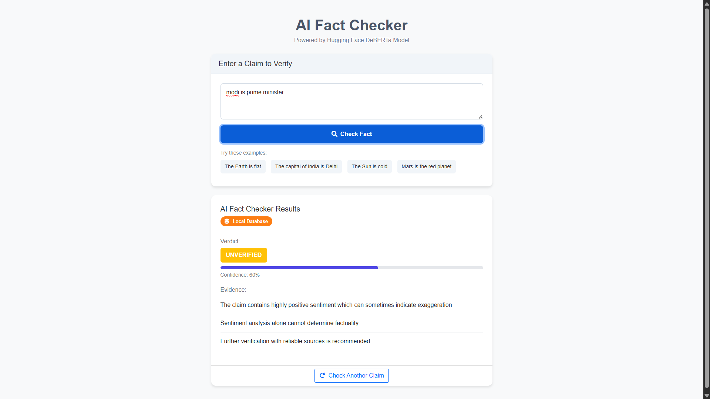

# AI Fact Checker with Hugging Face API

A focused fact-checking application using Hugging Face's state-of-the-art AI models to verify claims and provide evidence-based analyses.

## Features

- **Hugging Face API Integration**: Uses HF's powerful language models to analyze claims
- **Interactive UI**: Modern, responsive interface with animations and example claims
- **Evidence-Based Analysis**: Provides detailed evidence and context for each claim
- **Fallback Systems**: Gracefully handles API limitations with local analysis

## Technologies Used

- **Backend**: Flask, Python
- **Frontend**: HTML, CSS, JavaScript, Bootstrap 5
- **AI & ML**: Hugging Face Transformers, BART for natural language inference
- **Data Processing**: NLTK for text preprocessing

## Getting Started

### Prerequisites

- Python 3.8+
- pip (Python package manager)

### Installation

1. Clone the repository:
   ```
   git clone https://github.com/yourusername/ai-fact-checker.git
   cd ai-fact-checker
   ```

2. Install required packages:
   ```
   pip install -r requirements.txt
   ```

3. Create a .env file in the project root and add your Hugging Face API token:
   ```
   HUGGINGFACE_API_TOKEN=hf_your_token_here
   ```
   
   You need to obtain a token from [Hugging Face](https://huggingface.co/settings/tokens).

### Running the Application

1. Start the Flask server:
   ```
   python app.py
   ```

2. Open your browser and navigate to:
   ```
   http://127.0.0.1:5000
   ```

## How to Use

1. Enter a claim you want to fact-check in the text area, or click one of the example claims
2. Click "Check Fact"
3. View the detailed analysis results including:
   - Overall verdict (VERIFIED, FALSE, or UNVERIFIED)
   - Confidence level
   - Evidence supporting the verdict
   - Potential biases to consider
   - Important context information

## System Architecture

The application uses the Hugging Face Inference API with the BART large MNLI model for natural language inference to determine if claims are true, false, or unverified.

## Fallback Systems

If the API is unavailable or fails, the system uses:

1. **Knowledge Base Matching**: For common claims with established verdicts
2. **Sentiment Analysis**: As a basic heuristic when other methods fail

## Contributing

Contributions are welcome! Please feel free to submit a Pull Request.

## License

This project is licensed under the MIT License - see the LICENSE file for details.

## Acknowledgements

- Hugging Face for providing the transformer models and inference API
- Flask team for the web framework
- Bootstrap team for the frontend components

## Screenshots


